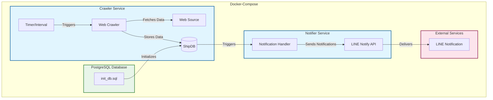

# PortCDM

PortCDM is a port management system that monitors and notifies stakeholders about ship movements and events in real-time.

## System Architecture

The system consists of three main services working together:

1. **Crawler Service**
   - Periodically scrapes ship data from port websites
   - Processes and normalizes the data
   - Stores information in the database
   - Configurable polling interval via `INTERVAL_TIME`

2. **Database Service (PostgreSQL)**
   - Stores ship status, events, and berth orders
   - Maintains data persistence across restarts
   - Key tables:
     - `ship_status`: Current status of ships
     - `ship_events`: Historical events for each ship
     - `ship_berth_order`: Berthing schedule and orders
     - `ship_voyage`: Ship passage times (5/10 mile markers)

3. **Notifier Service**
   - Monitors database for changes
   - Sends notifications via LINE Notify
   - Supports multiple stakeholder groups:
     - Pilots
     - Tugboat operators
     - Shipping agents
     - Port operators
     - Loading/unloading teams


## System Flow Chart




This flowchart provides an overview of a **Docker-Compose-based system** designed for web crawling, data storage, and real-time notifications. The architecture comprises three main components: **Crawler Service**, **PostgreSQL Database**, and **Notifier Service**, all integrated with external services for data fetching and notification delivery. Here's a detailed explanation:

---

### **1. Crawler Service**
- **Components**:
  - **Timer/Interval**: Acts as a scheduler to periodically trigger the web crawling process.
  - **Web Crawler**: The core component responsible for fetching data from the specified **Web Source** (e.g., websites, APIs).

- **Process**:
  - The Timer/Interval triggers the Web Crawler at regular intervals.
  - The Web Crawler retrieves relevant data from the Web Source.
  - After fetching the data, it stores it in the **PostgreSQL database** for further processing.


### **2. PostgreSQL Database**
- **Components**:
  - **ShipDB**: The database where fetched data is stored.
  - **init_db.sql**: A script used to initialize the database structure (tables, schemas, etc.).

- **Process**:
  - The database acts as a central repository for all crawled data.
  - Upon receiving new data, the database triggers the **Notifier Service** to initiate the notification process.


### **3. Notifier Service**
- **Components**:
  - **Notification Handler**: Responsible for processing database triggers and sending out notifications.
  - **LINE Notify API**: A third-party service for delivering notifications to users via the LINE messaging platform.

- **Process**:
  - The Notification Handler listens for changes in the database.
  - When triggered, it prepares and sends a notification to the LINE Notify API.
  - The LINE Notify API ensures the message is delivered to the target **LINE Notification** recipient.


### **4. External Services**
- **Web Source**: The external website or API from which the Web Crawler fetches data.
- **LINE Notification**: The user-facing platform where notifications are received.


### **Styling and Color Coding**
- **Services (Blue)**: Represent functional units performing operations (e.g., Crawler and Notifier).
- **Database (Green)**: Denotes the PostgreSQL database where data is stored and managed.
- **External Services (Pink)**: Refers to third-party platforms and APIs involved in data retrieval or notification delivery.


### **Key Features of the Architecture**
- **Scalable and Modular**: Each service runs independently within Docker containers, enabling seamless scaling.
- **Automated Data Flow**: The Timer/Interval and database triggers ensure an automated, end-to-end process.
- **Real-Time Notifications**: Notifications are sent as soon as new data is processed.
- **Extensible Design**: The architecture can easily accommodate additional data sources or notification channels.


## Setup and Configuration

1. Ensure you have Docker and Docker Compose installed on your system.

2. Create a `.env` file in the project root directory based on the `.env_example` file. The variables include:
   ```
   INTERVAL_TIME=<crawler_interval_time>
   POSTGRES_DB=shipdb
   POSTGRES_USER=portcdm
   POSTGRES_PASSWORD=password
   LINE_NOTIFY_TOKEN=<your_line_notify_token>
   LINE_NOTIFY_TOKEN_PILOT=<your_line_notify_token>
   LINE_NOTIFY_TOKEN_UNMOORING=<your_line_notify_token>
   LINE_NOTIFY_TOKEN_TUGBOAT=<your_line_notify_token>
   LINE_NOTIFY_TOKEN_SHIPPINGAGENT=<your_line_notify_token>
   LINE_NOTIFY_TOKEN_SHIPPINGCOMPANY=<your_line_notify_token>
   LINE_NOTIFY_TOKEN_LOADINGUNLOADING=<your_line_notify_token>
   ```
   Adjust these values according to your specific requirements.

3. Ensure you have an `init_db.sql` file in the project root directory to initialize the database.

## Services

### Database (db)

- Uses PostgreSQL 13
- Exposes port 5432
- Data is persisted using a named volume: postgres_db
- Initialized with `init_db.sql` script

### Notifier

- Built from `./notifier` directory
- Image: ghcr.io/jotpalch/portcdm-notifier
- Depends on both database services
- Restarts automatically
- Environment variables:
  - PYTHONUNBUFFERED: 1
  - LINE_NOTIFY_TOKEN: Set in .env file
  - Database credentials from .env file

### Crawler

- Built from `./crawler` directory
- Image: ghcr.io/jotpalch/portcdm-crawler
- Depends on the notifier service
- Restarts automatically
- Environment variables:
  - PYTHONUNBUFFERED: 1
  - INTERVAL_TIME: Set in .env file
  - Database credentials from .env file
- Mounts `./output` directory to `/app/output` in the container


## Usage

To start the project, run:

```
docker-compose up -d
```

To stop the project:

```
docker-compose down

# With delete database data
docker-compose down --volumes

```

## Data Flow

1. **Data Collection**
   - Crawler fetches data from port websites
   - Processes ship positions, events, and berth orders
   - Stores normalized data in PostgreSQL

2. **Event Processing**
   - Database triggers track changes
   - Notifier service monitors for updates
   - Relevant stakeholders are notified based on event type

3. **Notification Rules**
   - Different events trigger notifications to specific groups
   - Examples:
     - Pilot boarding → Pilots, Tugboats
     - Berthing changes → Port operators, Agents
     - Ship arrival → All stakeholders

## Additional Information

- The crawler service runs at intervals specified by the INTERVAL_TIME environment variable.
- The notifier service uses LINE Notify for notifications. Ensure you have a valid LINE Notify token.
- Database data is persisted even if containers are stopped or removed.

## Maintenance

- To view logs: `docker-compose logs`
- To rebuild images: `docker-compose build`
- To update services: `docker-compose pull` Pull the latest changes, rebuild images, and restart the services.


## Development

The project uses:
- Python 3.10 for services
- PostgreSQL 13 for database
- Selenium for web scraping
- Docker for containerization
- GitHub Actions for CI/CD
